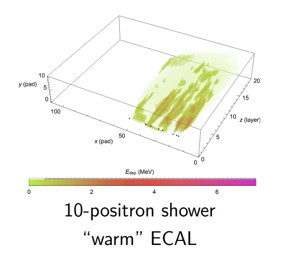
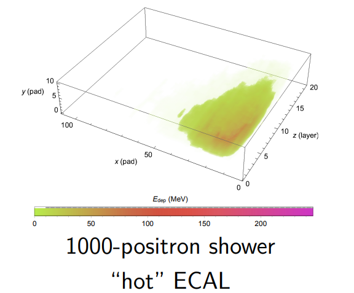
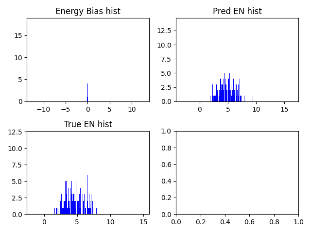
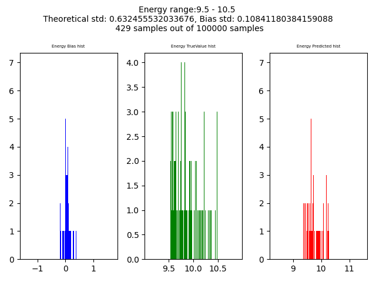
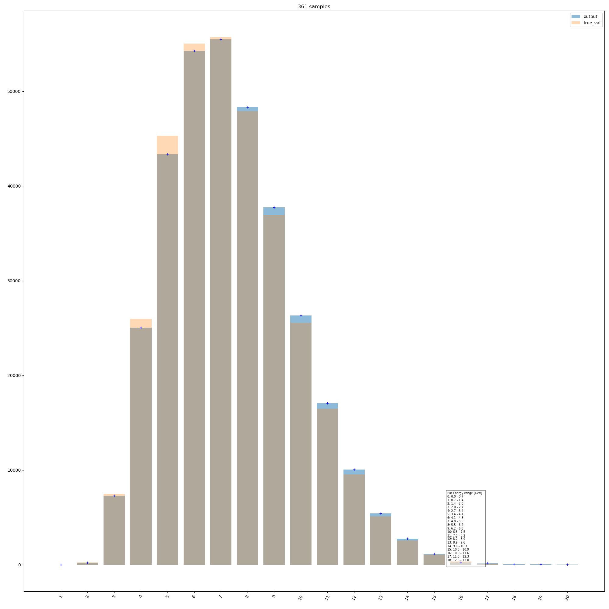
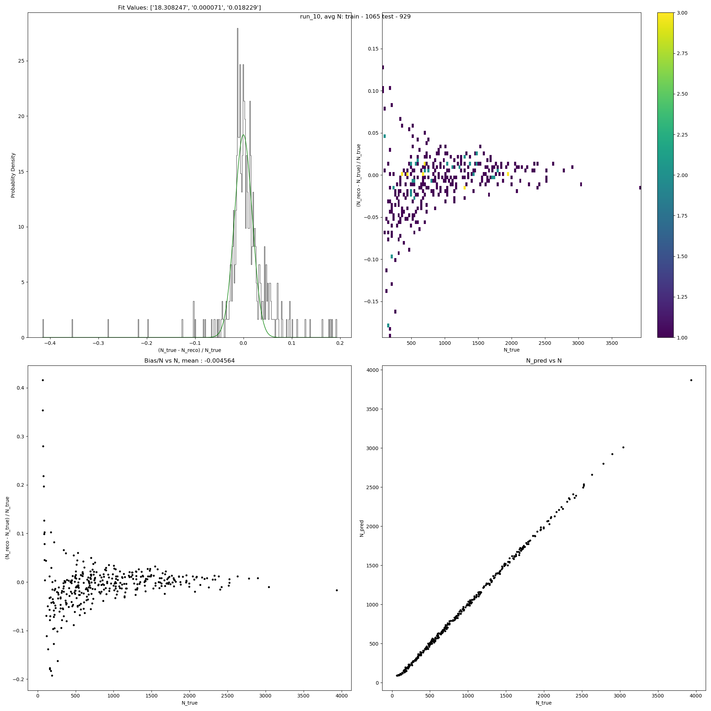

# LUXE detecetor ML project

## Summary
This project is meant to generate a Machine Learning framework that may be added to particle detectors.
The detector is a calorimeter, containing multiple pads that absorb the particle's energy.
 - For single positron data:
The model's goal, given a data sample of a positron beam hitting the calorimeter, is to predict the beam's initial energy.
An optional goal is also to predict the entry coordinates of the beam.
 - For multilple positrons data:
There are numerous goals explored. Predicting N the number of positrons in the sample, predicting E the mean
    energy value of the entire sample and predicting the energy distribution divided into 20 bins in the form of a histogram.

* The project's folder format and structure is taken from [This template](https://github.com/victoresque/pytorch-template)


## Requirements
* Python >= 3.5 (3.6 recommended)
* PyTorch >= 0.4 (1.2 recommended)
* tqdm (Optional for `test.py`)
* tensorboard >= 1.14
* numpy
* matplotlib <= 3.2.2
* scipy


## Data

* The data files are a list of energy values deposited in the pads of the calorimeter.
    The pads are indexed in an (x,y,z) format.
* Data was generated artificially using monte-carlo methods.
* Data labels for each calorimeter sample there are: (all values are continuous)
    - For single showers:
        * X entry coordinate
        * Y entry coordinate
        * Initial energy value
    - For 'IP0*' files (multiple showers):
        * A list of the energy value in GeV for each shower.
    
* The 'data_loader' folder handles reading the files, converting them to a 3d matrix etc.
* Attached in the 'data' folder is a fraction of the dataset for running example.

### Data types
There are 3 cases for positron beams:

Single           |  Several | Multipe
:-------------------------:|:-------------------------:|:-------------------------:
  |   |  


* Currently the project addresses only the first 'Cold' type of data.

### Data Generation

* In 'utils\\myutils.py' use the function "merge_and_split_data", with the relevant file path.
* This function generates 'train.pt' and 'test.pt' files from the relevant dataset, into the 'train' and 'test' folders 
in the 'data folder'. These datasets will then be loaded for training and testing.
  * NOTE: The dataset return values are eventually determined by the 'Bin_energy_data' class in the 'data_loaders.py' file.
    Change them accordingly. The current options are:
    * XY values.
    * N the number of showers.
    * Energy bins - 20 bins of energy containing the amount of showers for each energy range.
    * E the mean energy value of the sample.
    
* The dataset type also allows for data manipulation and analysis, some functionalities are commented out in the code.
## Model

* The model files are based on [this](https://github.com/kenshohara/video-classification-3d-cnn-pytorch)
 project. Originally meant for video data.
* The model code was modified to handle the project data with 3d matrices and the needed prediction values.
* Models predict either 1,2 or 3 values - 
    * 1 values means predicting only the energy.
    * 2 values means predicting the beam's entrance (x,y) coordinates
    * 3 values means both options.
    
* Current working model is ResNet10 - attached in 'saved/models' for running purposes.

## Results

results are evaluated by calculating the difference between the predicted values and the labels. Then by fitting a 
gaussian distribution to those values we get a mean and standart deviation. In 'utils' the file 'my_utils.py' handles 
these functionalities. (And some more, for example separating results by energy ranges).

Result examples:

1           |  2 
:-------------------------:|:-------------------------:
  |   |  

3           |  4 
:-------------------------:|:-------------------------:
  |   |  


## Recreate results:

With the 'config.json' as such:
```javascript
{
  "name": "ResNet10",           // training session name
  "n_gpu": 1,                   // number of GPUs to use for training.
  
  "arch": {
    "type": "General_model",       // name of model architecture to train
    "args": {"model_type": "ResNet10", "num_classes": 1} // num_classes determines the predictions, described above.

    }                
  },
  "data_loader": {
    "type": "CE_Loader",         // selecting data loader
    "args":{
      "data_dir": "data\\",                                   // dataset path
      "batch_size": 128,                                      // batch size
      "shuffle": true,                                        // shuffle training data before splitting
      "validation_split": 0.25                                // size of validation dataset. float(portion) or int(number of samples)
      "num_workers": 2,                                       // number of cpu processes to be used for data loading
      "chunk_low_num": 3,                                     // Determines the datafile to load
      "chunk_high_num": 4,                                    // 
      "partial_change": 1,                                    // non-relevant for this run, keep value as 1           
      "layer_change_lim": 0                                   // non-relevant for this run
    }
  },
  "optimizer": {
    "type": "Adam",
    "args":{
      "lr": 0.001,                     // learning rate
      "weight_decay": 0,               // (optional) weight decay
      "amsgrad": true
    }
  },
  "loss": "MSE_loss",                  // loss
  "metrics": [
    "bias_avg", "bias_std"            // list of metrics to evaluate
  ],                         
  "lr_scheduler": {
    "type": "StepLR",                  // learning rate scheduler
    "args":{
      "step_size": 50,          
      "gamma": 0.1
    }
  },
  "trainer": {
    "epochs": 100,                     // number of training epochs
    "save_dir": "saved/",              // checkpoints are saved in save_dir/models/name
    "save_freq": 1,                    // save checkpoints every save_freq epochs
    "verbosity": 2,                    // 0: quiet, 1: per epoch, 2: full
  
    "monitor": "min val_loss"          // mode and metric for model performance monitoring. set 'off' to disable.
    "early_stop": 10	                 // number of epochs to wait before early stop. set 0 to disable.
  
    "tensorboard": true,               // enable tensorboard visualization
  }
}
```

1. To use the model uploaded here run:
  ```
  python test.py --resume saved\models\Cont\model_best.pth -c config.json
  ```

2. To train a new model run: (Make sure to change the `chunk_low_num` and `chunk_high_num` to 0 and 3 since this serves as a training set. )
```
python train.py -c config.json`
```
3. To generate the energy distribution - after 'test.py' finished running, run 'my_utils.py'
